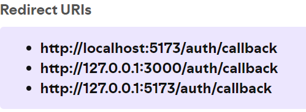

# 🎞️infotainment🎞️
## What is infotainment? 🤔
A website built using React meant to display your information and allow you to listen to music. Use infotainment to relax, study, or browse. The choice is yours.
## How do I use infotainment? 🐱‍💻
1. Clone this repository `git clone https://github.com/davido-noowin/infotainment.git`
2. CD into the directory and create a `.env` file in the root folder
3. Install dependencies via `npm install`
4. Register for a client ID and secret on the [Spotify developer dashboard](https://developer.spotify.com/dashboard) **_NOTE_**: _You must have a premium Spotify account_
5. In the Spotify developer dashboard, include the following redirect URIs when prompted:

6. In the `.env` file, add the following: 

`SPOTIFY_CLIENT_ID="my spotify client id"`
 

`SPOTIFY_CLIENT_SECRET="my spotify client secret"` 

7. Run the application by typing `npm run start` This will fire up the backend server for the Spotify API and the UI.

8. Select videos to play using the sidebar and login to Spotify to listen to music.

9. Use the built-in Spotify player to listen to your playlists or new songs/albums.

10. Sit back, relax, and enjoy.

## References 💡
* [Figma design](https://www.figma.com/design/8GSl8ELzVrjUhudOh2S0vL/infotainment?node-id=6-6&t=3T6RfQAnLcjKlcF4-1)
* [Spotify Web API documentation](https://developer.spotify.com/documentation/web-api)
* [Spotify Web Playback](https://developer.spotify.com/documentation/web-playback-sdk)
* [YouTube iFrame API](https://developers.google.com/youtube/iframe_api_reference)
* [Weather Open-Meteo API)](https://open-meteo.com/en/docs)
* More TBA

## Images 🖼️
Coming soon

## Built With 🔨
* React
* Express JS